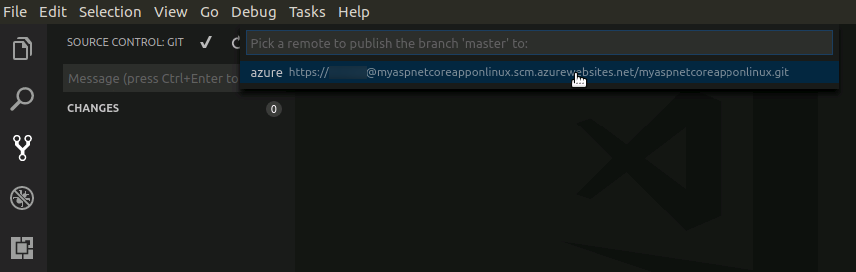

# Create a .NET Core web app in App Service on Linux

App Service on Linux provides a highly scalable, self-patching web hosting service using the Linux operating system. This lab shows how to create a [.NET Core](https://docs.microsoft.com/aspnet/core/) app on App Service on Linux using [Visual Studio Code](http://code.visualstudio.com). You create the web app using the [Azure CLI](https://docs.microsoft.com/cli/azure/get-started-with-azure-cli), and you use Git to deploy the .NET Core code to the web app.

## Create the app locally

In a terminal window on your machine, create a directory named `hellodotnetcore` and change the current directory to it.

```bash
mkdir hellodotnetcore
cd hellodotnetcore
```

Create a new .NET Core web app.

```bash
dotnet new web
```

## Run the app locally

Run the app using the .NET CLI. 

```bash
dotnet run
```

Open a web browser, and navigate to the app at `http://localhost:5000`.

You see the **Hello World** message from the sample app displayed in the page.


In your terminal window, press **Ctrl+C** to exit the web server. Initialize a Git repository for the .NET Core project.

```bash
git init
git add .
git commit -m "first commit"
```
## Open Visual Studio Code

Visual Studio Code offers great code-editing features out of the box. The rich ecosystem of extensions created by open-source developers offer additional functionality. A series of Azure extensions exist that make it easier for developers to get their apps up and running in Azure. 

To open Visual Studio Code in the working directory, type the following command:

```bash
code .
```

Visual Studio Code will open and you'll be able to see all of the source code created by the `dotnet new` command earlier. 


Press the `Ctrl + Shift + P` to open the Visual Studio Code command palette. Then type the string `Azure: Sign` to see the sign-in command. 


Visual Studio Code will generate a device code for you to use to login, and show you an information message that enables you to open a browser to login. When the browser opens, enter the code provided to you in Visual Studio Code into the text box. Then, click the **Continue** button. 


Provide the email address and password provided to you by the lab proctor. Once you provide these credentials the browser will log you in. From this point on in the lab, you'll be able to use this Azure subscription within Visual Studio Code. 


## Launch Azure Cloud Shell

The Azure Cloud Shell is a free interactive shell that you can use to run the steps in this article. It has common Azure tools preinstalled and configured to use with your account. Just click the **Copy** button to copy the code, paste it into the Cloud Shell, and then press enter to run it. Visual Studio Code offers an easy way to get to the Cloud Shell. Hit `Ctrl + Shift + P` to open up the command palette in VS Code and type the word `Cloud`, then select the Bash option. 


Then you'll see the Cloud Shell start up in the integrated terminal window in Visual Studio Code. 


In the Cloud Shell, create deployment credentials with the [`az webapp deployment user set`](/cli/azure/webapp/deployment/user?view=azure-cli-latest#az_webapp_deployment_user_set) command. This deployment user is required for FTP and local Git deployment to a web app. The user name and password are account level. _They are different from your Azure subscription credentials._

In the following example, replace *\<username>* and *\<password>* (including brackets) with a new user name and password. The user name must be unique within Azure. The password must be at least eight characters long, with two of the following three elements: letters, numbers, symbols. 

```azurecli-interactive
az webapp deployment user set --user-name <username> --password <password>
```

You should get a JSON output, with the password shown as `null`. If you get a `'Conflict'. Details: 409` error, change the username. If you get a ` 'Bad Request'. Details: 400` error, use a stronger password.

You create this deployment user only once; you can use it for all your Azure deployments.

## Create a Resource Group

A *resource group* is a logical container into which Azure resources like web apps, databases, and storage accounts are deployed and managed.

In the Cloud Shell, create a resource group with the [`az group create`](/cli/azure/group?view=azure-cli-latest#az_group_create) command. The following example creates a resource group named *myResourceGroup* in the *West US* location. To see all supported locations for App Service, run the [`az appservice list-locations`](/cli/azure/appservice?view=azure-cli-latest#az_appservice_list_locations) command.

```azurecli-interactive
az group create --name myResourceGroup --location "West US"
```
You generally create your resource group and the resources in a region near you. 

When the command finishes, a JSON output shows you the resource group properties.

## Create an App Service Plan

In the Cloud Shell, create an App Service plan in the resource group with the [`az appservice plan create`](/cli/azure/appservice/plan?view=azure-cli-latest#az_appservice_plan_create) command.

An *App Service plan* specifies the location, size, and features of the web server farm that hosts your app. You can save money when hosting multiple apps by configuring the web apps to share a single App Service plan.

App Service plans define:

* Region (for example: North Europe, East US, or Southeast Asia)
* Instance size (small, medium, or large)
* Scale count (1 to 10 instances)
* SKU (Basic, Standard)

The following example creates an App Service plan named `myAppServicePlan` in the **Standard** pricing tier (`--sku S1`) and in a Linux container (`--is-linux`).

```azurecli-interactive
az appservice plan create --name myAppServicePlan --resource-group myResourceGroup --sku S1 --is-linux
```
When the App Service plan has been created, the Azure CLI shows information similar to the following example:

```json
{ 
  "adminSiteName": null,
  "appServicePlanName": "myAppServicePlan",
  "geoRegion": "West Europe",
  "hostingEnvironmentProfile": null,
  "id": "/subscriptions/0000-0000/resourceGroups/myResourceGroup/providers/Microsoft.Web/serverfarms/myAppServicePlan",
  "kind": "linux",
  "location": "West Europe",
  "maximumNumberOfWorkers": 1,
  "name": "myAppServicePlan",
  < JSON data removed for brevity. >
  "targetWorkerSizeId": 0,
  "type": "Microsoft.Web/serverfarms",
  "workerTierName": null
} 
```

## Create a web app

Create a web app in the `myAppServicePlan` App Service plan. 

In the Cloud Shell, you can use the [`az webapp create`](/cli/azure/webapp?view=azure-cli-latest#az_webapp_create) command. In the following example, replace `<app_name>` with a globally unique app name (valid characters are `a-z`, `0-9`, and `-`). The runtime is set to `dotnetcore|1.1`. To see all supported runtimes, run [`az webapp list-runtimes`](/cli/azure/webapp?view=azure-cli-latest#az_webapp_list_runtimes). 

```azurecli-interactive
az webapp create --resource-group myResourceGroup --plan myAppServicePlan --name <app_name> --runtime "dotnetcore|2.0" --deployment-local-git
```

When the web app has been created, the Azure CLI shows output similar to the following example:

```json
Local git is configured with url of 'https://<username>@<app_name>.scm.azurewebsites.net/<app_name>.git'
{
  "availabilityState": "Normal",
  "clientAffinityEnabled": true,
  "clientCertEnabled": false,
  "cloningInfo": null,
  "containerSize": 0,
  "dailyMemoryTimeQuota": 0,
  "defaultHostName": "<app_name>.azurewebsites.net",
  "deploymentLocalGitUrl": "https://<username>@<app_name>.scm.azurewebsites.net/<app_name>.git",
  "enabled": true,
  < JSON data removed for brevity. >
}
```

You’ve created an empty web app in a Linux container, with git deployment enabled.

> NOTE:
> The URL of the Git remote is shown in the `deploymentLocalGitUrl` property, with the format `https://<username>@<app_name>.scm.azurewebsites.net/<app_name>.git`. Save this URL as you need it later.
>

Expand the **Azure App Service** explorer window in Visual Studio Code and you'll see the web app you just created. Open it up in your browser:

```bash
http://<app name>.azurewebsites.net
```

Here is what your new web app should look like:


## Push to Azure from Git

Back in the _local terminal window_, add an Azure remote to your local Git repository. Replace _&lt;paste\_copied\_url\_here>_ with the URL of the Git remote that you saved from *Create a web app*.

>Run this command in your ***local terminal***, not in the VS Code integrated terminal.

```bash
git remote add azure <deploymentLocalGitUrl-from-create-step>
```
Visual Studio Code's built-in Git tools allow you to easily push your code up to the repository fueling your web app. Click on the source control button in the side toolbar. Then, use the ... button at the top of the window to select the **Push to** command. 


Visual Studio Code will then show you a list of the remotes (there should be one). By selecting the appropriate remote - in this case the **azure** remote you just created - Visual Studio Code will push all the commits up to the source repository. Once you select the remote, Visual Studio Code will prompt you for the password. Use the deployment user password you created earlier. 



This command may take a few minutes to run. If you'd like to see the output while the command is executing, click the ... button in the source control explorer and select **Show Git Output** to see the Git output in the terminal window. 

## Browse to the app

Refresh the deployed application using your web browser.

```bash
http://<app_name>.azurewebsites.net
```

The .NET Core sample code is running in a web app with a built-in image.


**Congratulations!** You've deployed your first .NET Core app to App Service on Linux.

## Update and redeploy the code

In the local directory, open the _Startup.cs_ file. Make a small change to the text in the method call `context.Response.WriteAsync`:

```csharp
await context.Response.WriteAsync("Hello Azure!");
```

This time, use the source control features within Visual Studio Code to commit your changes to the repository. 


Once deployment has completed, switch back to the browser window that opened in the **Browse to the app** step, and hit refresh.


